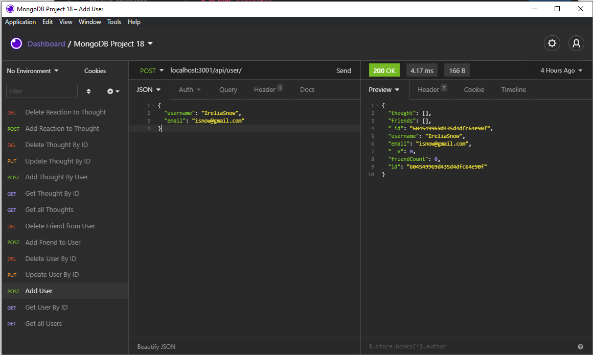

  

# social-network

## Description
This is a the back end of a potential social media application. With Functionalities ranging from: Creating/Adding/Reading/Deleting and updating Users, their thoughts and reacting to those thoughts. Since it is just the back end there is no application deployed so to be able test the created routes you will need insomnia core for the different type of API requests.

## Table of Contents

* [Installation](#installation)
* [Usage](#usage)
* [Contributing](#contributing)

## Installation

1. To install to your machine please copy the "GitHub CLI" link and import the repository after clicking the add "New Repository" link in GitHub. Paste the link when prompted and give the repository your own name. 

2. Clone the repository to your terminal by using git clone "".

3. After cloning, so long as you have Node.js installed to your machine you can simply type "npm init" to start the server and switch to Insomnia core to test the routes are start building your database.

## Usage

Sample Post Route to add a user:

## Contributing

Made with ❤️ by: [GitHub](https://github.com/jasmineakbari)

If you would like to contribute to this work please feel free to submit any push/pull request, create issues or reach out to me at my email: jasmineakbari@yahoo.com.